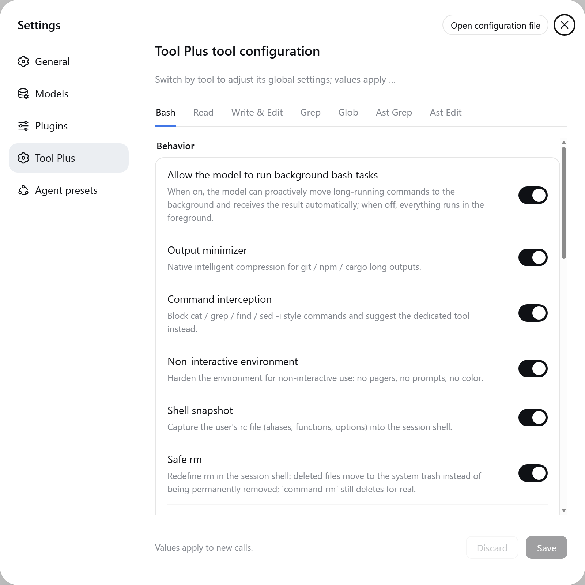

# dsh-tool-plus — Essential Tools Enhancement for DeepSeek Harness

[简体中文](./README.md) | English

[](https://www.npmjs.com/package/@xiaoso/dsh-tool-plus)
[](LICENSE)
[](https://nodejs.org)
[]()

Essential tools enhancement for DeepSeek Harness: persistent bash, structured read, multi-mode edit, atomic write, full-text search, and direct image reading — one plugin covers it all. Ported from the [Oh My Pi](https://github.com/can1357/oh-my-pi) core; once installed it automatically takes over the official bash / pwsh / file / search tools, with optional `ast_grep` / `ast_edit` structural search and rewrite.

## Features

- **bash**: persistent shell; `cd` and `export` keep state across calls; verbose logs (git/npm/cargo…) are condensed automatically; overlong output keeps only head and tail, with the full content written to disk for later retrieval; long-running commands are moved to the background automatically; optionally intercepts `cat`, `grep`, `find`, and `sed -i` to steer you toward the dedicated tools
- **Safe delete**: `rm` moves files to the system trash by default instead of deleting permanently, so accidental deletes are recoverable; use `command rm` for a real delete
- **read**: precise line-range reading (supports `:N-M`, `:raw`, and multiple ranges); large code files return a structural summary by default, with details expanded on demand; zip/tar archives, SQLite, notebooks, and PDFs read directly; PNG / JPEG / WebP / GIF images read directly, oversized ones scaled down automatically; can fetch web content (including images embedded in the page); SPA sites (content rendered dynamically by JS, e.g. excalidraw.com) are automatically fetched via local browser rendering
- **write**: atomic writes that return a diff of the changes; supports patch-style writing, and can write directly into zip/tar archive members and SQLite data
- **edit**: `replace` by default, with patch / hashline / apply-patch formats also supported; multi-hunk edits, uniqueness validation, fuzzy matching tolerant of whitespace differences
- **grep / glob**: full-text search and filename matching; mtime sorting, context lines, and configurable ignore rules
- **ast_grep / ast_edit** (optional): syntax-tree based structural code search and rewrite, enabled in settings
- **agent presets**: two companion templates — Standard enhanced and PTC (Code Mode)

Settings panel (Bash tab):



## Recommended Environment & Configuration

- **Full-access mode**: the plugin is best used under `danger-full-access`, which avoids file writes being blocked by mistake in sandboxed modes.

## Installation

### Install from npm (recommended)

#### Web

```sh
dsh plugin --profile web add --allow-build=@xiaoso/dsh-tool-plus --allow-build=koffi @xiaoso/dsh-tool-plus
```

`--allow-build` lets install scripts run (once for this package, once for `koffi`); it requires pnpm ≥ 10.4, and on pnpm 11+ omitting it fails the install with `ERR_PNPM_IGNORED_BUILDS`. If your pnpm is too old for the flag, allow the scripts first and re-run:

- Append to `~/.dsh/profiles/web/pnpm-workspace.yaml`: `allowBuilds:`, `  '@xiaoso/dsh-tool-plus': true` and `  koffi: true`
- Or run `cd ~/.dsh/profiles/web && pnpm approve-builds --all` (pnpm ≥ 10.32)

#### Desktop

The profile is owned by the desktop app, so `dsh plugin --profile desktop` is refused; install inside the profile directory instead:

```sh
cd ~/.dsh/profiles/desktop
pnpm add --allow-build=@xiaoso/dsh-tool-plus --allow-build=koffi @xiaoso/dsh-tool-plus
```

### Local development

```sh
dsh plugin --profile web add link:<path to this repo>
```

### Presets

| Preset | Base | What it is |
|---|---|---|
| **Tool Plus 标准增强版** | official standard | everything in standard mode, with the file/shell toolset swapped for this plugin |
| **Tool Plus PTC 增强版** | official PTC (Code Mode) | same, but composing multi-step operations through Code Mode's `run_code` |

Both presets are **declared by the plugin**: installing it (as a profile bundle) brings two `@deepseek-ai/dsh-agent-preset` declaration rows along in its patch layer, so they appear in the preset list immediately. There is no install step, and the plugin writes nothing at startup.

**Tool Plus → Presets** in the settings page is where you change them. Since dsh 0.1.7 the official preset page is read-only and the `agent_preset` tool is gone, so this panel is the only graphical entry point:

- **Minimal update** — disables just the official tool rows still mounted, touching nothing else
- **Align to template** — replaces this row's whole plugin list with the selected template
- **Revert to bundled** — removes the override you wrote in the profile configuration (`<profile>/cordis.patch.yml`), falling back to the bundled declaration
- **View differences** — shows which entries differ before you touch anything

Writes go through the harness's own `ctx.configEditor`, so they inherit the profile lock, concurrency protection, atomic write and rollback.

> Upgrading from 0.1.9 or earlier: `~/.dsh/.agent-presets/` is **read by nothing** any more (0.1.7 moved presets into the patch layer), so it is safe to delete; the panel tells you when it finds one.

## Configuration

Works out of the box, no configuration needed. Common tweaks: background threshold (`autoBackgroundMs`), timeouts (`defaultTimeoutMs` / `maxTimeoutMs`), the output truncation window, the default edit mode (`editMode`, default `replace`), and the structured summary toggle (`readSummarizeEnabled`).

## Requirements

- **dsh CLI**: installed globally, `npm i -g @deepseek-ai/dsh`
- **Node.js** ≥ 22.19 or ≥ 24
- **Git Bash** (recommended): serves as the bash execution environment on Windows
- Targets DeepSeek Harness `dsh` v0.1.7-rc.2 (pre-release; interfaces may change)

## Notes

- No standalone `pwsh` tool: shell work is handled by the more capable persistent `bash`

**Safe rm sends deleted files to the system trash.** Where they land, and whether you can see them:

| | Windows | macOS | Linux |
|---|---|---|---|
| **Location** | Recycle Bin | Trash `~/.Trash` | `$XDG_DATA_HOME/Trash`; defaults to `~/.local/share/Trash` |
| **Another volume / external disk** | That volume's Recycle Bin | That volume's `.Trashes` | `.Trash-<uid>` at that mount point |
| **Visible in the OS trash** | Yes | Yes | Same volume: yes; another volume: open that location |
| **File name** | Unchanged | Unchanged | A UUID; the original name comes from `.trashinfo` |
| **Put back** | Yes | Yes | Depends on the file manager |
| **Implementation** | Shell API | System API | Third-party XDG implementation |
| **Known limits** | No Recycle Bin on network drives | Requires macOS 10.12+ | Some desktops do not list it — restore from the location above |

## Build

```sh
pnpm install
pnpm build     # type declarations (tsc) + tsdown bundle + asset copy
pnpm typecheck
pnpm test      # includes real-bash cases; needs Git Bash on Windows, auto-skips when missing
```

## License

[MIT](LICENSE); third-party component licenses in [THIRD_PARTY_NOTICES.md](THIRD_PARTY_NOTICES.md).
