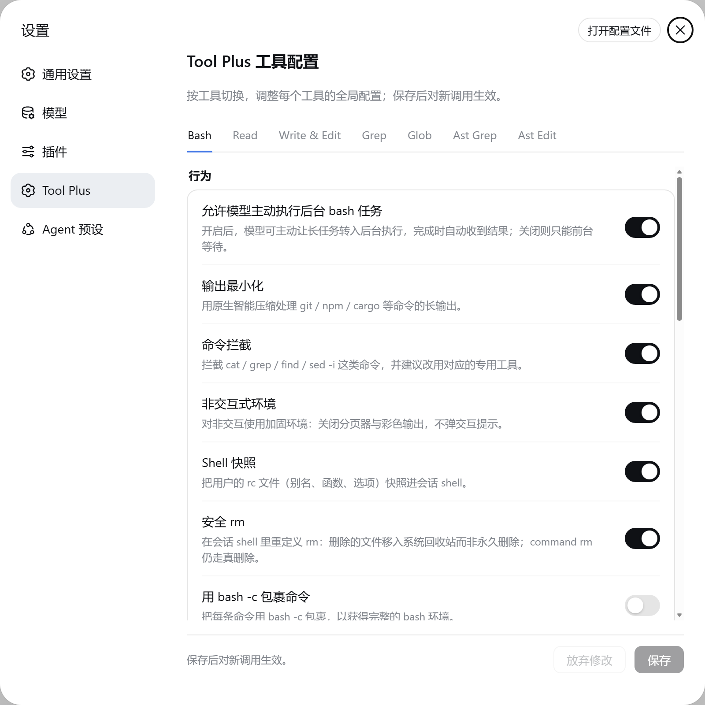

# dsh-tool-plus — DeepSeek Harness 基础工具增强

简体中文 | [English](./README.en.md)

[](https://www.npmjs.com/package/@xiaoso/dsh-tool-plus)
[](LICENSE)
[](https://nodejs.org)
[]()

DeepSeek Harness 基础工具增强：持久 bash、结构化 read、多模式 edit、原子 write、全文搜索、图像直读，一个插件全覆盖。基于 [Oh My Pi](https://github.com/can1357/oh-my-pi) 内核移植，安装后自动接管官方 bash / pwsh / 文件 / 搜索工具，另有可选的 `ast_grep` / `ast_edit` 结构化搜索与重写。

## 功能特性

- **bash**：持久 shell，`cd`、`export` 跨调用保持状态；冗长日志（git/npm/cargo…）自动压缩；超长输出只保留头尾，完整内容落盘可回读；长命令自动转后台；可选拦截 `cat`、`grep`、`find`、`sed -i`，引导改用专用工具
- **安全删除**：`rm` 默认把文件移入系统回收站而非永久删除，误删可恢复；需要真删时用 `command rm`
- **read**：按行区间精准读取（支持 `:N-M`、`:raw`、多区间）；大代码文件默认返回结构摘要，细节按需展开；zip/tar 归档、SQLite、notebook、PDF 直接读；PNG / JPEG / WebP / GIF 图片直读，超大图自动缩放；可抓取网页内容（含网页内图片）；SPA 站点（内容由 JS 动态渲染，如 excalidraw.com）自动改用本机浏览器渲染后抓取
- **write**：原子写入，返回修改 diff；支持补丁式写入，可直接写 zip/tar 归档成员与 SQLite 数据
- **edit**：replace 默认，另支持 patch / hashline / apply-patch 三种补丁格式；多段编辑、唯一性校验、空白差异模糊匹配
- **grep / glob**：全文搜索与文件名匹配；mtime 排序、上下文行、忽略规则可配置
- **ast_grep / ast_edit**（可选）：基于语法树的结构化代码搜索与重写，可在设置中开启
- **agent 预设**：标准增强版 / PTC（Code Mode）两套配套模板，一条命令安装（见安装章节）

设置面板（Bash 工具页）：



## 推荐环境与配置

- **完全权限模式**：建议在 `danger-full-access` 下使用本插件，可避免沙箱模式下文件写入被误拦。

## 安装

插件与预设**都要安装**：

- **工具插件**：提供全套工具，自动接管官方 bash / pwsh / 文件 / 搜索工具；
- **agent 预设**：官方预设里没有这些工具的配置，直接用默认配置会缺能力——标准版 / PTC 两套模板就是来补齐这块的。

### 从 npm 安装（推荐）

```sh
dsh plugin --profile web add @xiaoso/dsh-tool-plus
```

### 版本选择

插件版本与 dsh 版本一一对应，按你的 dsh 版本选择安装：

| 插件版本（dist-tag） | 对应 dsh 版本 | 安装命令 |
| --- | --- | --- |
| 0.1.2-rc.1（`next`） | dsh v0.1.2-rc.1（`next`） | `dsh plugin --profile web add @xiaoso/dsh-tool-plus@next` |
| 0.1.2（`latest`） | dsh v0.1.1-rc.2 | `dsh plugin --profile web add @xiaoso/dsh-tool-plus` |

插件与 dsh 的 `next` 版本号保持一致（当前均为 0.1.2-rc.1）；不带 tag 安装的是 `latest` 稳定版。

### 从 GitHub 安装

跟踪最新开发版：

```sh
dsh plugin --profile web add github:xiaoso456/dsh-tool-plus
```

### 本地开发

```sh
dsh plugin --profile web add link:<本仓库路径>
```

### 预设安装

**方法一 · 使用 npx 脚本安装**

```sh
npx @xiaoso/dsh-tool-plus-presets
```

**方法二 · 使用大模型配置预设**（不依赖上面的包）——把下面这段发给一个能改你电脑上文件的 AI 会话：

```text
请为我安装 DeepSeek Harness 的两个增强 agent 预设。

1. 找到全局 dsh 包内的官方预设目录 config/agent-presets/，其中有 standard 与 code 两套模板，
   各含 preset.yml 和 agent.cordis.yml。（Windows 在 npm 全局 node_modules\@deepseek-ai\dsh\ 下；
   macOS/Linux 先跑 npm root -g 定位；找不到就全盘搜索已安装的 @deepseek-ai/dsh 包。）
2. 在 ~/.dsh/.agent-presets/ 下新建 tool-plus-standard 与 tool-plus-ptc 两个目录。

3. tool-plus-standard：把官方 standard 的两个文件复制过来，然后修改：
   - preset.yml 整个替换为：
       name: Tool Plus 标准增强版
       description: 标准模式全部能力，文件/Shell 工具集替换为 @xiaoso/dsh-tool-plus，pwsh 默认禁用
       order: 2
   - agent.cordis.yml：
     a. 把 id: tool-bash 的条目改为
          - id: tool-plus
            name: '@xiaoso/dsh-tool-plus'
            disabled: true
     b. 把 id: tool-pwsh 条目的平台条件禁用改成固定一行 disabled: true
     c. 整块删除 id: tool-fs 和 id: tool-fs-search 两个条目（后者还带 sampleOverCapGlobResults 配置）

4. tool-plus-ptc：把官方 code 的两个文件复制过来，做第 3 步完全相同的三处修改，
   但 preset.yml 替换为：
       name: Tool Plus PTC 增强版
       description: PTC(Code Mode) 全部能力，文件/Shell 工具集替换为 @xiaoso/dsh-tool-plus，pwsh 默认禁用
       order: 3

5. 完成后列出这两个目录的文件树，并提醒我重启运行中的 dsh 让预设生效。
```

两法效果相同：文件落到 `~/.dsh/.agent-presets/`，重启 dsh 后在会话里选用预设即生效。

## 配置

开箱即用，无需配置。需要微调时常用项有：后台阈值（`autoBackgroundMs`）、超时（`defaultTimeoutMs` / `maxTimeoutMs`）、输出截断窗口、编辑默认模式（`editMode`，默认 `replace`）、结构化摘要开关（`readSummarizeEnabled`）。抓取相关：可切换网页转 Markdown 的后端（`fetchReader`，含浏览器 JS 渲染——SPA 页面），设置面板里可一键「探测浏览器」查看本机可用的 Chrome/Edge。

## 环境要求

- **dsh CLI**：需全局安装，`npm i -g @deepseek-ai/dsh`
- **Node.js** ≥ 22.19 或 ≥ 24
- **Git Bash**（推荐）：Windows 上作为 bash 执行环境
- 版本对应：`next`（0.1.2-rc.1）适用于 dsh v0.1.2-rc.1；`latest`（0.1.2）适用于 dsh v0.1.1-rc.2（pre-release，接口可能变动，详见安装章节「版本选择」）

## 注意事项

- 不提供单独的 `pwsh` 工具：shell 场景由功能更全的持久 `bash` 统一承担

## 构建

```sh
pnpm install
pnpm build     # tsc 声明 + tsdown 打包 + 资产复制
pnpm typecheck
pnpm test      # 含真实 bash 用例，Windows 需 Git Bash，缺失自动 skip
```

## License

[MIT](LICENSE)，第三方组件许可见 [THIRD_PARTY_NOTICES.md](THIRD_PARTY_NOTICES.md)。
